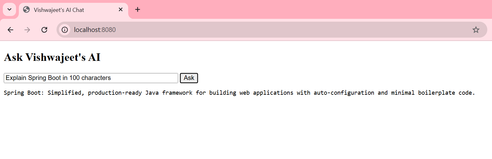

# Spring AI + Ollama Local Chatbot

A simple **AI chatbot application** built using **Spring Boot** and **Spring AI** that connects to a **locally running Ollama Large Language Model (Llama3)**.

The application allows users to interact with an AI model through a **web-based UI** or via a **REST API endpoint**.

This project demonstrates how to build an **AI-powered backend system without using paid APIs like OpenAI**, by running the LLM locally.

---

# 🚀 Features

- Run **LLM locally using Ollama**
- Integrated **Llama3 model**
- Built using **Spring Boot + Spring AI**
- Simple **chat UI in browser**
- REST API for AI queries
- No OpenAI API key required
- Fully offline AI chatbot

---

# 🛠 Tech Stack

| Technology | Purpose |
|------------|--------|
Java 17 | Programming language |
Spring Boot | Backend framework |
Spring AI | AI integration |
Ollama | Local LLM runtime |
Llama3 | AI model |
Maven | Build tool |
HTML + JavaScript | Frontend UI |

---

# 🏗 Application Architecture

```
Browser UI
   │
   ▼
Spring Boot REST Controller
   │
   ▼
Spring AI Client
   │
   ▼
Ollama API (localhost:11434)
   │
   ▼
Llama3 Model
```

The UI sends requests to the Spring Boot backend, which then calls the **Ollama API** to generate AI responses.

---

# 💻 UI Overview

The application includes a **simple chatbot interface** where users can ask questions and receive responses from the AI model.

### UI Workflow

```
User enters question
        ↓
UI sends REST request
        ↓
Spring Boot processes request
        ↓
Ollama generates response
        ↓
Response displayed in UI
```

---

# 📸 Chat UI Screenshot



---

# ⚙️ Setup Instructions

## 1 Install Ollama

Download and install Ollama from:

https://ollama.com

Verify installation:

```
ollama --version
```

---

## 2 Run the Llama3 Model

```
ollama run llama3
```

This will download the model the first time.

Ollama server will run at:

```
http://localhost:11434
```

---

## 3 Clone the Repository

```
git clone https://github.com/vishu1478/spring-ai-ollama-chatbot.git
```

```
cd spring-ai-ollama-chatbot
```

---

## 4 Build the Project

```
mvn clean install
```

---

## 5 Run the Spring Boot Application

```
mvn spring-boot:run
```

Application will start at:

```
http://localhost:8080
```

---

# 🌐 Access the Chat UI

Open your browser and go to:

```
http://localhost:8080
```

You can now interact with the chatbot.

---

# 📡 Example API Call

You can also interact using the REST API.

Example request:

```
GET http://localhost:8080/ai/ask?question=Explain Spring Boot
```

Example response:

```
Spring Boot is a Java framework used to create standalone, production-ready Spring applications quickly.
```

---

# 📂 Project Structure

```
spring-ai-ollama-chatbot
│
├── src
│   ├── main
│   │   ├── java
│   │   └── resources
│
├── screenshots
│   └── chat-ui.png
│
├── pom.xml
├── README.md
└── .gitignore
```

---

# 📌 Future Improvements

Possible enhancements:

- Streaming AI responses
- Chat history support
- Vector database integration
- Document-based AI search
- Improved UI design

---

# 👨‍💻 Author

**Vishwajeet Agrawal**

Java Developer | Spring Boot | Microservices | AI Integration

---

⭐ If you like this project, consider giving it a **star on GitHub**.
